# Mimari

Bu belge Dikte Native'in ses paketinden son metne kadar izlediği yolu ve hata durumlarında hangi veriyi koruduğunu açıklar.

## Sınırlar

- Swift 6, SwiftUI/AppKit ve yalnız ARM64
- Minimum macOS 15
- Tek menü çubuğu uygulama süreci
- Python, Qt, Homebrew, ffmpeg, whisper-server, event tap ve LaunchAgent yok
- Kayıt sırasında `AVCaptureSession`; uzun kayıtta geçici `codex` alt süreci
- Ham ses için kalıcı dosya yok

## Veri akışı

```mermaid
flowchart LR
    A[Option+D] --> B[arming]
    B -->|ilk gerçek paket| C[recording]
    C --> D[16 kHz mono Float32]
    D --> E[Silero VAD]
    E --> F[en fazla 20 sn Whisper parçaları]
    F --> G[Turbo Whisper]
    G -->|eksik parça| H[özgün aralık retry]
    H -->|hâlâ eksik| I[bütün kayıt fallback]
    G --> J[deterministik temizlik]
    H --> J
    I --> J
    J -->|süre ≤ eşik| K[pano / otomatik yapıştırma]
    J -->|süre > eşik| L[kalıcı Codex thread]
    L --> K
    L -->|hata / iptal / timeout| J
```

## Durum makinesi

Uygulamanın tek bir ana durumu vardır:

| Durum | Anlamı | Çıkış |
|---|---|---|
| `idle` | Kayıt veya metin işi yok | Kısayol/menü ile `arming` |
| `arming` | MacBook mikrofonu bağlanıyor, ilk gerçek paket bekleniyor | Paketle `recording`; iki başarısız denemeyle `idle` |
| `recording` | Ses belleğe ekleniyor ve gerçek RMS gösteriliyor | İkinci kısayolla `processing` |
| `processing(stage)` | Ses hazırlama, VAD, Whisper, retry, temizlik, Codex veya kopyalama | Başarı/hata/iptal sonrası tek `returnToIdle()` yolu |

İlk paket gelmeden `recording` gösterilmez. Kayıt animasyonu bu nedenle oturumun açıldığına değil, mikrofondan veri geldiğine kanıttır.

## Ses yakalama

`AudioRecorder` yerleşik MacBook mikrofonunu `AVCaptureDevice` kimliğiyle bulur. Bluetooth kulaklık veya Continuity Camera mikrofonuna sessiz fallback yapmaz ve macOS'un sistem genelindeki giriş aygıtını değiştirmez.

Mikrofonun doğal örnekleme hızı, kanal sayısı ve interleaved düzeni kabul edilir. `AVAudioConverter` sonucu 16 kHz, mono, non-interleaved Float32'ye dönüştürür. Dönüştürücü ve PCM tamponları aynı format sürdüğü sürece tekrar kullanılır. Ses callback'i uygulamaya özel seri kuyrukta; oturum başlatma/durdurma ayrı seri kuyrukta çalışır.

Tanı verisi cihaz adı/kimliği, format, callback ve örnek sayısı, RMS/peak, konuşma süresi, retry ve dönüşüm hatasını içerir. Ham örnekler tanıya yazılmaz.

## VAD ve Whisper

Gömülü `ggml-silero-v6.2.0.bin` modeli şu sabitlerle çalışır:

- eşik `0.50`
- minimum konuşma `100 ms`
- minimum sessizlik `400 ms`
- kenar dolgusu `200 ms`
- parça üst sınırı `20 saniye`
- parçalar arası yapay sessizlik `250 ms`

VAD konuşma bulamaz ve enerji de düşükse Whisper çalıştırılmaz. Belirgin enerji varsa veya VAD modeli kullanılamazsa bütün-ses fallback uygulanır.

Whisper `large-v3-turbo-q5_0`, Metal, flash attention, dört thread ve `beam_size=5` kullanır. Türkçe ayarında dil `tr` olarak sabittir. Otomatik dil yalnız ilk parçada algılanır. Parçalar arasında serbest konuşma bağlamı taşınmaz; yalnız doğrulanmış özel terimler prompt olarak verilir.

Bir parça şu durumlarda retry ister:

- sıfır token veya boş metin,
- sessizlik halüsinasyonu,
- en az iki saniye konuşmaya göre olağan dışı kısa sonuç.

Retry özgün, kesintisiz kayıt aralığında yeni decoder durumu, kesin Türkçe ve `no_speech_thold=0.35` ile yapılır. Son güvence bütün 16 kHz kaydın bir kez çözülmesidir. Kurtarılamayan eksiklik `incomplete` kaydı üretir ve otomatik yapıştırmayı engeller.

## Codex

`duration > threshold` olduğunda deterministik temizlenmiş metin Codex'e gider. Çalıştırılabilir dosya önce `/Applications/ChatGPT.app/Contents/Resources/codex`, sonra uygulama `PATH`'i içinde aranır.

Codex:

- yeni pencere açmadan `codex exec --json` kullanır,
- `read-only` sandbox ve `approval_policy=never` ile çalışır,
- kullanıcı config/rules dosyalarını yüklemez,
- Application Support içindeki boş `CodexRuntime` dizininde çalışır,
- `thread.started` kimliğini gelir gelmez UserDefaults'a yazar,
- sonraki uzun kayıtta aynı thread'i resume eder,
- 120 saniye timeout uygular.

Thread kayıpsa bir kez yeni thread denenir. Her hata, timeout ve iptal temizlenmiş yerel metne düşer.

## Model ve bellek yaşam döngüsü

Whisper ilk kayıtta arka planda hazırlanabilir. Tek sahibi AppModel olan idle scheduler, bütün pipeline çıkışları `returnToIdle()` yoluna ulaştıktan 120 saniye sonra modeli loglu release yoluyla bırakır; yeni kayıt timer'ı iptal eder. `MemoryPressureMonitor`, DispatchSource olaylarını bir `AsyncStream` üzerinden MainActor'a taşır:

- `idle`: warning/critical modelin hemen bırakılmasını ister.
- `arming/recording`: preload iptal edilir, ses kaydı kesilmez.
- `processing`: bırakma ertelenir ve işlem `idle` durumuna döndüğünde uygulanır.

İptal edilmiş preload sonradan `isLoaded=true` yazamaz. Shutdown ses oturumunu ve kısayolu hemen durdurur; Whisper/VAD/Codex temizliği ana thread'i senkron bekletmez.

## Kalıcı veri

| Veri | Konum | İçerik |
|---|---|---|
| Model | `~/Library/Application Support/Dikte Native/Models/` | 547 MB Whisper modeli, geçici `.part` ve doğrulama receipt'i |
| Geçmiş | `.../Dikte Native/history.json` | Son 100 metin kaydı ve tanılar |
| Düzeltmeler | `.../Dikte Native/corrections.json` | Yalnız kullanıcı onaylı eşleşmeler |
| Crash breadcrumb | `.../Dikte Native/active-session.json` | Session ID, aşama, model/bellek baskısı; içerik yok |
| Codex runtime | `.../Dikte Native/CodexRuntime/` | Uygulamaya özel geçici çalışma dizini |
| Ayarlar | macOS UserDefaults | Dil, kısayol, eşik, thread ID ve görünüm tercihleri |

History atomik Codable JSON olarak yazılır ve 100 kayıtla sınırlandırılır.
